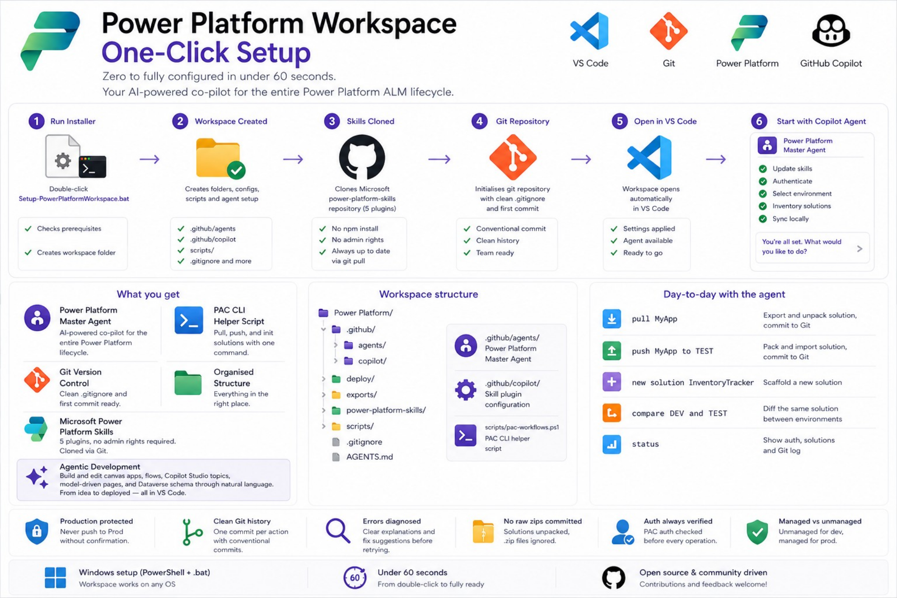

# Power Platform Workspace — One-Click Setup 

[](https://github.com/SteCiu01/Power-Platform-Workspace-One-Click-Setup/releases)

Pre-release — functional and tested, evolving fast.
Contributions and feedback welcome.

**Zero to fully configured in under 60 seconds.**

Double-click one file, answer one question, and you have a complete
Power Platform development environment with an AI agent that handles
authentication, environment sync, and solution management for you.

---

<p align="center">
  
</p>

---

## Why this exists

This is a personal project — and like most personal projects, it started from a real frustration.

I was doing a significant amount of bulk work across Power Platform: building flows in **Power Automate**, designing apps in **Power Apps**, and assembling agents in **Copilot Studio**, all tied together through **solutions and Dataverse**.

What I was looking for was something like the experience I already had on the data side of the Microsoft stack: the **[Microsoft Fabric](https://marketplace.visualstudio.com/items?itemName=fabric.vscode-fabric)** and **[Fabric Data Engineering VS Code](https://marketplace.visualstudio.com/items?itemName=SynapseVSCode.synapse)** extensions give a rich, terminal-driven, agentic workflow right inside VS Code. I wanted the same thing for Power Platform development.

What I found was **[Power Platform Tools for VS Code](https://marketplace.visualstudio.com/items?itemName=microsoft-IsvExpTools.powerplatform-vscode)**. It provides the PAC CLI, auth panels, and environment browsing — but the experience didn't feel as immediate and user-friendly, at least for me, as the Fabric extensions are. On top of that, I noticed that the general GitHub Copilot agent was not referencing the Power Platform skills out of the box.

So I put together a custom Copilot agent that I trigger at the start of every Power Platform session. It loads its skills, authenticates against my tenant, syncs my environments with the local folder, and gets me ready to work in seconds. It became an indispensable part of my daily flow almost immediately. It also complements the Power Platform Tools extension nicely — having both active gives you visual panels for auth and environments alongside the agent's natural-language workflow.

Then I thought: *this should be replicable*. Not just for me — for anyone who works with Power Platform and wants to enhance the developer workflow. So I packaged everything up into a one-click installer and a shareable agent configuration.

---

> **⚠️ Disclaimer — Please read before using**
>
> This is a **personal and community project**, built in my spare time for fun and to share something useful. It is not an official Microsoft product, is not affiliated with Microsoft in any way, and comes with no guarantees of any kind.
>
> **AI involvement:** This project was built with significant help from **GitHub Copilot** in VS Code. Copilot assisted in writing the installer scripts, agent configuration files, documentation, and a large portion of the "heavy lifting" — from structuring the codebase and handling edge cases, to generating boilerplate and refining prompts. The core ideas, design decisions, and testing are mine; the speed at which it came together is Copilot's.
>
> **Early stage — use with care:** This is very much a v0.1. It has been tested and works, but it is at the beginning of its life. Given the level of AI involvement in its creation, there may be bugs, edge cases, or behaviours that do not work as expected in your specific environment. **Do not use this in production environments without fully understanding what the scripts do.** Always review the code before running it.
>
> That said — it is a genuinely interesting starting point, and I hope it saves you time and sparks ideas. Feedback, bug reports, and contributions are very welcome.

---

## What is this?

This is a **one-click workspace bootstrapper and Copilot agent configuration**
for Power Platform development in VS Code. Instead of manually setting up
folders, config files, CLI tools, and agent definitions, you run a single
script and everything is ready.

Once set up, a custom Copilot agent called **Power Platform Master Agent** lives
inside your workspace and acts as your AI-powered co-pilot for the full Power
Platform development lifecycle. It handles authentication,
environment sync, and solution management, but it also **builds and edits Power
Platform components directly**: canvas apps, model-driven app pages, cloud flows,
Copilot Studio topics, and Dataverse schema — all through natural language in the
Copilot Chat panel, guided by Microsoft's official [power-platform-skills](https://github.com/microsoft/power-platform-skills).

---

## What you get

| Component | Description |
|---|---|
| **Power Platform Master Agent** | A custom Copilot Chat agent that covers the full development lifecycle — auth, environment sync, solution management, **and agentic development**: build and edit canvas apps, flows, Copilot Studio topics, model-driven pages, and Dataverse schema through natural language |
| **Microsoft Power Platform Skills** | Git-cloned from [microsoft/power-platform-skills](https://github.com/microsoft/power-platform-skills) — no npm install or admin rights required (see [FAQ](#faq)) |
| **PAC CLI Helper Script** | `scripts/pac-workflows.ps1` — pull, push, and init solutions with a single command |
| **Git Version Control** | Repository initialised with a clean `.gitignore` and first commit out of the box |
| **Organised Folder Structure** | `exports/`, `deploy/`, `scripts/`, `.github/agents/` — everything where it should be |

---

## Prerequisites

Before running the installer, make sure you have:

| Tool | Required? | How to get it |
|---|---|---|
| **VS Code 1.99+** | Yes | [code.visualstudio.com](https://code.visualstudio.com) |
| **GitHub Copilot + Agent Mode** | Yes | Install from VS Code Extensions marketplace. Agent mode must be enabled (`chat.agent.enabled`). Note: org tenants may need admin to enable this. |
| **Git** | Yes | [git-scm.com](https://git-scm.com) |
| **PAC CLI** | Recommended | Auto-installed if .NET SDK is present, or the agent will guide you on first run |
| **[Power Platform Tools](https://marketplace.visualstudio.com/items?itemName=microsoft-IsvExpTools.powerplatform-vscode)** | Nice to have | Adds visual auth/environment panels, YAML language support, and auto-provides the PAC CLI. Not required — the agent works independently |

---

## Quick start

### 1. Get the files

You need **two files** — keep them in the same folder (ideally as it is here in the [power-platform-workspace-installer](https://github.com/SteCiu01/Power-Platform-Workspace-One-Click-Setup/tree/main/power-platform-workspace-installer) folder:

```
Setup-PowerPlatformWorkspace.bat    ← double-click this
Setup-PowerPlatformWorkspace.ps1    ← the engine (called by the .bat)
```

### 2. Run the installer

**Double-click `Setup-PowerPlatformWorkspace.bat`.**

You'll see a terminal window:

```
===============================================
 Power Platform Workspace — One-click Setup
===============================================

Enter a name for your workspace folder (default: Power Platform): _
```

Type a name or press **Enter** to accept the default. The script will:

1. Check all prerequisites (git, VS Code, pac)
2. Create the folder at `C:\Users\<you>\<folder name>\`
3. Generate all config files (`.gitignore`, agent definition, Copilot instructions, helper scripts)
4. Clone Microsoft's Power Platform Skills repository
5. Initialise a git repo with the first commit
6. Open the workspace in VS Code

### 3. Start working

Once VS Code opens:

1. Open **Copilot Chat** (sidebar or `Ctrl+Shift+I`)
2. Select **Power Platform Master Agent** from the agent dropdown
3. Type anything — the agent takes over from here

On first message the agent will:
- Update skills to latest from GitHub
- Walk you through authentication (`pac auth`)
- Let you pick your environment
- Inventory all solutions
- Sync everything locally

---

## What the agent can do

### Automated session startup

You don't configure anything manually. On your **first message** each session, the agent automatically:

1. **Updates skills** — pulls the latest power-platform-skills from GitHub
2. **Authenticates you** — checks for an existing `pac auth` profile or walks you through device-code login
3. **Lets you pick your environment** — lists all environments you have access to and connects to the one you choose
4. **Inventories everything** — runs `pac solution list` (and flow/canvas list where supported) to show all solutions, loose flows, and apps in the environment
5. **Syncs locally** — if no local folder exists, pulls and unpacks every solution automatically; if files already exist, detects conflicts and asks you which version to keep (local or platform)

All of this happens before you even ask your first real question.

### Day-to-day commands

Once your session is active, just tell the agent what you need in plain English:

**Solution & environment management**

| Command | What happens |
|---|---|
| `pull MyApp` | Exports and unpacks the solution into a local folder, commits to git |
| `push MyApp to TEST` | Packs the local folder, imports to the target environment, commits |
| `new solution InventoryTracker` | Scaffolds a new solution with `pac solution init` |
| `compare DEV and TEST` | Pulls the same solution from both environments and diffs them |
| `status` | Shows auth state, solution list, and git log |

**Agentic development — build and edit components**

| Example request | What happens |
|---|---|
| `add a text input and a submit button to the Contact screen in MyApp` | Edits the canvas app's PA YAML source directly, following the canvas-apps skill instructions, then shows you a diff |
| `create a new generative page for the Account table in my model-driven app` | Scaffolds a React + TypeScript + Fluent page using the model-apps skill and deploys it via PAC CLI |
| `add a condition to my approval flow that sends an email when status is Rejected` | Edits the cloud flow's JSON source inside the unpacked solution and explains every change |
| `add a new topic to my Copilot Studio agent that handles order status questions` | Edits the topic YAML file in the unpacked solution, following the dialog structure Power Platform expects |
| `add a new column 'Priority' (choice field) to the Task table in Dataverse` | Updates the entity and attribute XML in the solution's `Other/` folder and flags what needs a manual publish |

> **Honest scope note:** Canvas apps and model-driven pages are guided by official Microsoft-authored skill instructions from the cloned repo. For Power Automate flows, Copilot Studio topics, and Dataverse schema — no dedicated skill exists yet in that repo — so the agent works from its own knowledge of the file formats, editing the unpacked source directly. This works well in practice but is less prescriptive. Always review diffs before pushing.

### Skill-based development

The agent doesn't just move solutions around — it can **build and edit Power Platform components** using Microsoft's official [power-platform-skills](https://github.com/microsoft/power-platform-skills) library. Before each development task, the agent reads the relevant `SKILL.md` file and follows its instructions step by step to apply the correct edits to your source files, then shows you a diff before touching anything.

The skills cover four areas today:

| Skill | What you can ask for |
|---|---|
| **canvas-apps** | Add/modify screens, controls, and properties in canvas apps via PA YAML. Requires Canvas Authoring MCP server + .NET 10 SDK |
| **model-apps** | Generate and deploy custom pages for model-driven apps (React + TypeScript + Fluent) |
| **code-apps** | Build and deploy standalone code apps connected to Power Platform via connectors (React + Vite + TypeScript) |
| **power-pages** | Create and modify Power Pages code sites (React, Angular, Vue, or Astro) |

For components not yet covered by a dedicated skill — **Power Automate flows** (JSON), **Copilot Studio topics** (YAML), and **Dataverse schema** (solution XML) — the agent reads and edits the unpacked source files directly and walks you through each change.

> **Why git clone instead of npm install?** Corporate environments typically
> block npm global installs and require admin approval. This workspace clones
> the skills repo via git — which you already have — so there's zero extra
> tooling or permissions needed. See [FAQ](#faq) for details.

### Conflict resolution and sync

When your local files and the platform are out of sync, the agent handles it:

- **Solution exists online but not locally** — pulled automatically, no question needed
- **Solution exists both places** — the agent asks you per-solution whether to keep local or overwrite from platform
- After resolving, everything is committed in one clean commit

### Safety built in

- **Production is protected** — the agent will never import to Production unless you explicitly type `confirm push to prod`
- **Git history stays clean** — one commit per logical action with conventional commit messages (`chore:` for pulls, `feat:` for pushes)
- **Errors are diagnosed** — if a `pac` command fails, the agent explains what went wrong and suggests a fix before retrying
- **Auth is always verified** — the agent checks `pac auth list` before any export or import
- **No raw zips committed** — solutions are always unpacked before committing; `.zip` files stay in gitignored folders
- **Managed vs unmanaged** — unmanaged for dev work, managed for production deployments

---

## Workspace structure

After setup, your folder looks like this:

```
Power Platform/
├── .git/
├── .github/
│   ├── agents/
│   │   └── power-platform-master-agent.agent.md   ← the agent brain
│   └── copilot-instructions.md                    ← workspace-level Copilot context
├── .gitignore
├── AGENTS.md                                      ← quick-reference guide
├── deploy/                                        ← packed .zip files for import
├── exports/                                       ← raw .zip exports (gitignored)
├── power-platform-skills/                         ← Microsoft skills (gitignored)
│   └── plugins/
│       ├── canvas-apps/
│       ├── code-apps/
│       ├── mcp-apps/
│       ├── model-apps/
│       └── power-pages/
└── scripts/
    └── pac-workflows.ps1                          ← CLI helper script
```

When you connect to an environment, the agent creates a folder at the root
named after that environment (e.g. `DEV/`, `TEST/`) containing your unpacked
solution source files.

---

## How it works under the hood

The setup script (`Setup-PowerPlatformWorkspace.ps1`) is fully self-contained.
It does not download anything except the public Microsoft skills repository.
Every file it creates is embedded directly in the script — no external
templates, no internet dependencies beyond `git clone`.

The `.bat` wrapper exists solely to bypass Windows PowerShell execution policy
restrictions. It calls the `.ps1` with `-ExecutionPolicy Bypass` so the script
runs regardless of your organisation's policy settings.

The script is **idempotent** — if you run it against an existing folder, it
skips files that already exist and only fills in what's missing.

---

## FAQ

**Q: Can I move the workspace folder after creation?**
A: Yes. The workspace is fully portable. Just open the new location in VS Code.

**Q: What if I don't have the PAC CLI installed?**
A: The script will warn you but still create everything. When you start your
first session, Power Platform Master Agent will guide you through installing it.

**Q: Does this work on macOS or Linux?**
A: The setup script is Windows-only (PowerShell + .bat). However, the
workspace itself — including the Power Platform Master Agent — works on
any OS once the files exist. You’d just need to create the folder structure
manually or adapt the script.

**Q: Why does this clone skills via git instead of installing them?**
A: The official way to install power-platform-skills is via npm global
install, which requires admin/elevated rights on most corporate machines
and often needs IT approval. By git-cloning the repo directly, this
workspace avoids that entirely — you only need git, which is already a
prerequisite. The agent reads the SKILL.md files from the local clone
before each task, so the skills work without any plugin framework.

**Q: Can multiple people share the same workspace via git?**
A: Absolutely. Push the workspace to a shared repo. Each team member clones it,
selects Power Platform Master Agent, and connects to their own environment.
The `.gitignore` keeps exports, skills, and environment files clean.

**Q: How do I update the skills?**
A: The agent does this automatically at the start of every session. You can also
run `cd power-platform-skills && git pull` manually.

---

## Current status (v0.1.0-preview)

| Area | Status |
|---|---|
| One-click setup (.bat + .ps1) | **Working** — tested on Windows 10/11 |
| Agent session flow (auth → env → inventory → sync) | **Working** — tested daily |
| Pull / push / compare / status commands | **Working** |
| Skill-based editing via local SKILL.md files | **Working** — agent reads and follows instructions from the cloned repo |

This is a pre-release. Expect rough edges. If something breaks, [open an issue](https://github.com/SteCiu01/Power-Platform-Workspace-One-Click-Setup/issues).

---

## Contributing

This project is open source and actively looking for feedback, ideas, and
improvements from the community. All contributions are welcome — from typo
fixes to new agent workflows to cross-platform support.

See **[CONTRIBUTING.md](CONTRIBUTING.md)** for the full guide — how to set up,
branch naming, commit style, and PR expectations.

Quick links:
- [Report a bug](https://github.com/SteCiu01/Power-Platform-Workspace-One-Click-Setup/issues/new?template=bug_report.md)
- [Request a feature](https://github.com/SteCiu01/Power-Platform-Workspace-One-Click-Setup/issues/new?template=feature_request.md)
- [Open issues](https://github.com/SteCiu01/Power-Platform-Workspace-One-Click-Setup/issues)

---

## Files in this repository

| File | Purpose |
|---|---|
| `power-platform-workspace-installer/Setup-PowerPlatformWorkspace.bat` | Double-click entry point — share this with your team |
| `power-platform-workspace-installer/Setup-PowerPlatformWorkspace.ps1` | The full installer — must be in the same folder as the .bat |
| `CHANGELOG.md` | Version history and release notes |
| `CONTRIBUTING.md` | Guide for contributors |
| `CODE_OF_CONDUCT.md` | Community standards |
| `SECURITY.md` | How to report security vulnerabilities |
| `LICENSE` | MIT License |
| `README.md` | This file |

---

## License

This project is licensed under the MIT License — see the [LICENSE](https://github.com/SteCiu01/Power-Platform-Workspace-One-Click-Setup/blob/main/LICENSE) file for details.
