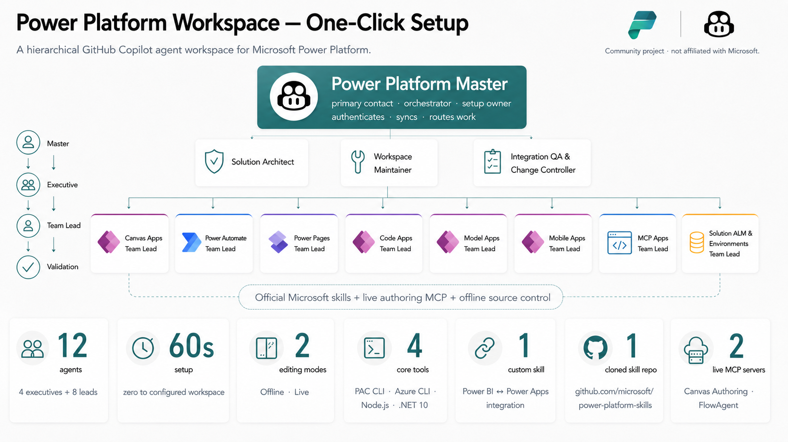

# Power Platform Workspace — One-Click Setup 

[](https://github.com/SteCiu01/Power-Platform-Workspace-One-Click-Setup/releases)
[](https://github.com/SteCiu01/Power-Platform-Workspace-One-Click-Setup/actions/workflows/validate.yml)

Pre-release — functional and tested, evolving fast.
Contributions and feedback welcome.

**Zero to fully configured in under 60 seconds.**

Double-click one file, answer one question, and you have a complete
Power Platform development environment with an AI agent that handles
authentication, environment sync, and solution management for you.

---

<p align="center">
  
</p>

---

## Contents

- [Why this exists](#why-this-exists)
- [What is this?](#what-is-this)
- [What you get](#what-you-get)
- [Prerequisites](#prerequisites)
- [Quick start](#quick-start)
  - [1. Get the files](#1-get-the-files)
  - [2. Run the installer](#2-run-the-installer)
  - [3. Start working](#3-start-working)
  - [4. Keeping it up to date](#4-keeping-it-up-to-date)
- [What the agents can do](#what-the-agents-can-do)
  - [The team — who does what](#the-team--who-does-what)
  - [Automated session startup](#automated-session-startup)
  - [Day-to-day commands](#day-to-day-commands)
  - [Skill-based development](#skill-based-development)
  - [Editing canvas apps and flows: offline vs live (real-time)](#editing-canvas-apps-and-flows-offline-vs-live-real-time)
  - [Conflict resolution and sync](#conflict-resolution-and-sync)
  - [Safety built in](#safety-built-in)
- [Workspace structure](#workspace-structure)
- [How it works under the hood](#how-it-works-under-the-hood)
- [FAQ](#faq)
- [Current status (v0.3.0)](#current-status-v030)
- [Contributing](#contributing)
- [Files in this repository](#files-in-this-repository)
- [License](#license)

---

## Why this exists

This is a personal project — and like most personal projects, it started from a real frustration.

I was doing a significant amount of bulk work across Power Platform: building flows in **Power Automate**, designing apps in **Power Apps**, and assembling agents in **Copilot Studio**, all tied together through **solutions and Dataverse**.

What I was looking for was something like the experience I already had on the data side of the Microsoft stack: the **[Microsoft Fabric](https://marketplace.visualstudio.com/items?itemName=fabric.vscode-fabric)** and **[Fabric Data Engineering VS Code](https://marketplace.visualstudio.com/items?itemName=SynapseVSCode.synapse)** extensions give a rich, terminal-driven, agentic workflow right inside VS Code. I wanted the same thing for Power Platform development.

What I found was **[Power Platform Tools for VS Code](https://marketplace.visualstudio.com/items?itemName=microsoft-IsvExpTools.powerplatform-vscode)**. It provides the PAC CLI, auth panels, and environment browsing — but the experience didn't feel as immediate and user-friendly, at least for me, as the Fabric extensions are. On top of that, I noticed that the general GitHub Copilot agent was not referencing the Power Platform skills out of the box.

So I put together a custom Copilot agent that I trigger at the start of every Power Platform session. It loads its skills, authenticates against my tenant, syncs my environments with the local folder, and gets me ready to work in seconds. It became an indispensable part of my daily flow almost immediately. It also complements the Power Platform Tools extension nicely — having both active gives you visual panels for auth and environments alongside the agent's natural-language workflow.

That single agent was the seed. As I leaned on it more, one generalist trying to do everything started to show its limits: canvas apps, cloud flows, Copilot Studio topics, model-driven pages and Dataverse schema each have their own conventions, and cramming all of that context into one agent made it a jack-of-all-trades and a master of none. So it evolved — from a lone assistant into a small **agentic team**: one **Master** that handles setup, understands what you're asking for, and routes the work, delegating to specialist **Team Leads** who each own a single Power Platform area and go deep on it, with executives for planning, quality-gating and workspace upkeep sitting alongside. Same idea as before — get me set up and get out of my way — just organised like a real team, so each part can be genuinely good at its own job.

Then I thought: *this should be replicable*. Not just for me — for anyone who works with Power Platform and wants to enhance the developer workflow. So I packaged everything up into a one-click installer and a shareable agent configuration.

---

> **⚠️ Disclaimer — Please read before using**
>
> This is a **personal and community project**, built in my spare time for fun and to share something useful. It is not an official Microsoft product, is not affiliated with Microsoft in any way, and comes with no guarantees of any kind.
>
> **AI involvement:** This project was built with significant help from **GitHub Copilot** in VS Code. Copilot assisted in writing the installer scripts, agent configuration files, documentation, and a large portion of the "heavy lifting" — from structuring the codebase and handling edge cases, to generating boilerplate and refining prompts. The core ideas, design decisions, and testing are mine; the speed at which it came together is Copilot's.
>
> **Early stage — use with care:** This is very much a pre-release version. It has been tested and works, but it is at the beginning of its life. Given the level of AI involvement in its creation, there may be bugs, edge cases, or behaviours that do not work as expected in your specific environment. **Do not use this in production environments without fully understanding what the scripts do.** Always review the code before running it.
>
> That said — it is a genuinely interesting starting point, and I hope it saves you time and sparks ideas. Feedback, bug reports, and contributions are very welcome.

---

## What is this?

This is a **one-click workspace bootstrapper and Copilot agent configuration**
for Power Platform development in VS Code. Instead of manually setting up
folders, config files, CLI tools, and agent definitions, you run a single
script and everything is ready.

Once set up, a team of custom Copilot agents lives inside your workspace and
acts as your AI-powered co-pilot for the full Power Platform development
lifecycle. You talk to one entry point — **Power Platform Master** — which
handles authentication, environment sync and solution management, then
**delegates** the actual building and editing to specialist **Team Leads**
(Canvas Apps, Power Automate, Power Pages, Code Apps, Model Apps, Mobile Apps,
MCP Apps, Solution ALM). Together they **build and edit Power
Platform components directly**: canvas apps, model-driven app pages, cloud flows,
Copilot Studio topics, and Dataverse schema — all through natural language in the
Copilot Chat panel, guided by Microsoft's official [power-platform-skills](https://github.com/microsoft/power-platform-skills).

---

## What you get

| Component | Description |
|---|---|
| **Agent team (12 agents)** | A hierarchy of custom Copilot Chat agents: 4 executives (**Power Platform Master**, **Solution Architect**, **Integration QA & Change Controller**, **Workspace Maintainer**) + 8 topic **Team Leads** (Canvas Apps, Power Automate, Power Pages, Code Apps, Model Apps, Mobile Apps, MCP Apps, Solution ALM & Environments). The Master coordinates and delegates; the Leads build and edit through natural language |
| **Microsoft Power Platform Skills** | Git-cloned from [microsoft/power-platform-skills](https://github.com/microsoft/power-platform-skills) — no npm install or admin rights required (see [FAQ](#faq)) |
| **Custom embedded skill** | `pbi-powerapps-integration` — a maintainer-authored, house-style skill (committed in `.github/skills/`) for canvas apps embedded in Power BI via the Power Apps visual, written from a real production incident |
| **Live authoring MCP servers** | `.vscode/mcp.json` registers the **Canvas Authoring** server (real-time canvas coauthoring via `dnx` / .NET 10) and the **Power Automate FlowAgent** server (Node.js 18+, authenticated with `az login`). The installer auto-installs both runtimes by default; the servers start on demand |
| **Integrity + self-test** | `.github/installed-manifest.json` records a SHA256 of every installer-managed file (re-checkable with `-VerifyRoot`), and a post-generation self-test writes `.github/agent-docs/guardrail-status.json` |
| **PAC CLI Helper Script** | `scripts/pac-workflows.ps1` — pull, push, and init solutions with a single command |
| **Git Version Control** | Repository initialised with a clean `.gitignore` and first commit out of the box |
| **Organised Folder Structure** | `exports/`, `deploy/`, `scripts/`, `.github/agents/` — everything where it should be |

---

## Prerequisites

Before running the installer, make sure you have:

| Tool | Required? | How to get it |
|---|---|---|
| **VS Code 1.117.0+** | Yes | [code.visualstudio.com](https://code.visualstudio.com) — older versions have known bugs that break Copilot agent tools |
| **GitHub Copilot + Agent Mode** | Yes | Install from VS Code Extensions marketplace. Agent mode must be enabled (`chat.agent.enabled`). Note: org tenants may need admin to enable this. |
| **Git** | Yes | [git-scm.com](https://git-scm.com) |
| **PAC CLI** | Auto-installed | The installer installs it for you (via .NET tool or the standalone MSI) — no action needed |
| **.NET 10 SDK** | Auto-installed (live canvas authoring) | Needed for the live canvas authoring flow (real-time coauthoring via MCP). The installer auto-installs it by default; if that fails, grab it from [dotnet.microsoft.com](https://dotnet.microsoft.com/download/dotnet/10.0). Offline editing works without it |
| **Node.js 18+** | Auto-installed (live flow authoring) | Powers the Power Automate **FlowAgent** MCP server (live cloud-flow authoring, authenticated with `az login`). The installer auto-installs it by default via winget — non-blocking; if it can't, everything else still works and offline flow editing is unaffected (grab it from [nodejs.org](https://nodejs.org) and re-run to enable live authoring later) |
| **[Power Platform Tools](https://marketplace.visualstudio.com/items?itemName=microsoft-IsvExpTools.powerplatform-vscode)** | Auto-installed (optional) | Adds visual auth/environment panels, YAML language support, and auto-provides the PAC CLI. The installer detects it and installs it via `code --install-extension` if missing — non-blocking, and the agent works without it |
| **Azure CLI (`az`)** | Auto-installed | Two jobs: it **authenticates the Power Automate FlowAgent MCP server** (`az login`) for live cloud-flow authoring, and it **auto-resolves live Power Apps `appId`s** during the cross-environment **repoint** workflow (specific Power BI ↔ Power Apps tasks). The installer auto-installs it by default via winget — non-blocking; if it can't, grab it from [aka.ms/installazurecli](https://aka.ms/installazurecli). Everything else works without it |

---

## Quick start

### 1. Get the files

You need **two files** — keep them in the same folder (ideally as it is here in the [power-platform-workspace-installer](https://github.com/SteCiu01/Power-Platform-Workspace-One-Click-Setup/tree/main/power-platform-workspace-installer) folder):

```
Setup-PowerPlatformWorkspace.bat    ← double-click this
Setup-PowerPlatformWorkspace.ps1    ← the engine (called by the .bat)
```

### 2. Run the installer

**Double-click `Setup-PowerPlatformWorkspace.bat`.**

You'll see a terminal window:

```
===============================================
 Power Platform Workspace — One-click Setup
===============================================

Enter a name for your workspace folder (default: Power Platform): _
```

Type a name or press **Enter** to accept the default. The script will:

1. Check all prerequisites (git, VS Code 1.117.0+, GitHub Copilot, pac CLI, .NET 10 SDK, Node.js 18+, and Azure CLI) — confirming each with a green check and auto-installing the ones it can (the live-authoring runtimes are non-blocking)
2. Create the folder at `C:\Users\<you>\<folder name>\`
3. Generate all config files — the **12 agent definitions**, Copilot instructions, `AGENTS.md`, helper scripts, and the VS Code + MCP config (`canvas-authoring` + `flow-agent`)
4. Write the workspace guidance and **integrity manifest** (SHA256 of every managed file) and run a self-test over the generated agents
5. Clone Microsoft's Power Platform Skills repository
6. Initialise a git repo with the first commit
7. Open the workspace in VS Code

### 3. Start working

Once VS Code opens:

1. Open **Copilot Chat** (sidebar or `Ctrl+Shift+I`)
2. Select **Power Platform Master** from the agent dropdown (start here unless
   you know exactly which specialist you want — the Master routes for you)
3. Type anything — the agent takes over from here

On first message the agent will:
- Update skills to latest from GitHub
- Walk you through authentication (`pac auth`)
- Let you pick your environment
- Inventory all solutions
- Sync everything locally

### 4. Keeping it up to date

When a new version is released, updating is the same one step as installing:

1. [Download the latest installer files](https://github.com/SteCiu01/Power-Platform-Workspace-One-Click-Setup/tree/main/power-platform-workspace-installer)
2. **Double-click `Setup-PowerPlatformWorkspace.bat`** and enter the **same folder name** you used originally
3. The installer detects the existing folder and switches to **update mode** — it force-refreshes the 12 agent definitions, Copilot instructions, helper scripts, VS Code configs, and the power-platform-skills clone, prunes anything older versions shipped but no longer do, then stops
4. Your solutions, environment folders, exports, and any personal files you created are **not touched**

That's it. Reopen the workspace in VS Code and you're on the latest version.

> **Important — what update mode overwrites vs. what it never touches.**
> To guarantee the workspace keeps working, the installer is **authoritative**
> over everything it ships. On every update it:
> - **Force-refreshes** the 12 agents, Copilot instructions, embedded skills,
>   helper scripts, and VS Code configs to the shipped version — **any edits you
>   made to those files are overwritten.**
> - **Force-refreshes** the cloned `power-platform-skills` to match upstream (local
>   edits are stashed, recoverable with `git -C power-platform-skills stash list`).
> - **Self-prunes**: files an older version shipped but the current one no longer
>   ships are removed automatically, so no stale scaffolding lingers.
>
> **Your work is safe.** Solutions, environment folders, exports, and **any new
> files you create are never touched** — they are not part of what the installer
> manages, so they are never overwritten or pruned.
>
> **Want to customise or extend?** Don't edit our agents, skills, or configs (they
> get reset). Instead **add a NEW file** in `.github/` — a new agent, a new skill,
> a new instructions file. New files are yours and the installer leaves them alone.

> **Maintaining a shared workspace?** If your team clones a workspace you own, it's worth re-running the installer periodically even without a new release — update mode re-pulls the latest Microsoft `power-platform-skills` and re-applies the newest agent definitions, Copilot instructions and configs, so everyone stays on current guidance. Your solutions and personal files stay untouched.

---

## What the agents can do

The workspace runs as a **team**: you talk to **Power Platform Master**, which handles setup and routing and **delegates** the building and editing to the specialist **Team Leads** (Canvas Apps, Power Automate, Power Pages, Code Apps, Model Apps, Mobile Apps, MCP Apps, Solution ALM), with the Solution Architect, Integration QA & Change Controller and Workspace Maintainer working alongside. In practice you just describe what you want and the right agent picks it up — the sections below describe what the team does for you.

At a glance, the team can:

- **Run your whole session for you** — on your first message the Master authenticates you (`pac auth`), lets you pick an environment, inventories every solution/flow/app, and syncs it all locally (see [Automated session startup](#automated-session-startup)).
- **Manage solutions and environments** — pull, push, compare and status across DEV/TEST/PROD with git history kept clean (see [Day-to-day commands](#day-to-day-commands)).
- **Build and edit components through official skills** — seven Microsoft-authored skills from the cloned [power-platform-skills](https://github.com/microsoft/power-platform-skills) cover canvas apps, cloud flows, Power Pages, model-driven pages, code apps, mobile apps and MCP widgets; only Copilot Studio topics and Dataverse schema are edited from their unpacked source (see [Skill-based development](#skill-based-development)).
- **Edit live, in real time** — two MCP servers (both runtimes installed by default) let the agents author **canvas apps** in an open Power Apps Studio session and **cloud flows** straight against your environment, with an automatic fall back to offline editing when a runtime is missing (see [Editing canvas apps and flows: offline vs live](#editing-canvas-apps-and-flows-offline-vs-live-real-time)).
- **Apply house knowledge** — a committed custom skill (`pbi-powerapps-integration`) adds Power BI ↔ Power Apps embedding guidance and the cross-environment repoint workflow (see [Custom embedded skill](#custom-embedded-skill--power-bi--power-apps-integration)).
- **Keep you safe** — Production imports need an explicit `confirm push to prod`, auth is re-checked before every export/import, and nothing is committed as a raw zip (see [Safety built in](#safety-built-in)).

### The team — who does what

Every agent has a single, well-defined job and only the tools it needs for it. You normally only talk to **Power Platform Master**; it routes to the rest. The table below is the full roster — the four executives that coordinate, review and maintain, and the eight Team Leads that each own one Power Platform area.

**Tools legend:** **Delegate** = can hand work to other agents · **Read** = read files · **Search** = search the workspace · **Run** = run terminal/CLI commands (`pac`, `az`, git, `dnx`, `node`) · **Edit** = write to files.

#### Executives (coordinate, plan, gate, maintain)

| # | Agent | What it does | Tools | Skills / MCP |
|---|---|---|---|---|
| **000** | **Power Platform Master** | Single entry point. Runs the setup/working flow, understands your request, then **delegates** — to the Solution Architect for design or straight to a Team Lead for execution. Coordinates, never implements. | Delegate · Read · Search · Run | — (routes to skills via the Leads) |
| **001** | **Solution Architect** | Advisory design authority for tough or cross-cutting work: picks the right component types, plans the solution/ALM shape, and sequences delegation across the Leads. **Read-only — produces a plan, never edits.** | Delegate · Read · Search | — (planning only) |
| **002** | **Integration QA & Change Controller** | Reviews changes before they leave the workspace: validates solution packs, runs git diffs, gates Production imports and enforces the `confirm push to prod` rule. **Verify only — never authors source.** | Read · Search · Run | — (review + Prod gate) |
| **003** | **Workspace Maintainer** | Keeps the workspace itself healthy: refreshes the cloned `power-platform-skills`, maintains `.vscode` config / MCP registrations / the custom embedded skill, and repairs setup drift. Edits scaffolding, not your solution source. | Read · Search · Run · Edit | Maintains all skills + `.vscode/mcp.json` |

#### Team Leads (build and edit — one area each)

| # | Agent | What it does | Tools | Skills / MCP |
|---|---|---|---|---|
| **010** | **Canvas Apps Lead** | Owns canvas apps: offline `.pa.yaml` authoring **and live coauthoring** via the Canvas Authoring MCP server, plus Power BI-embedded (`PowerBIIntegration`) apps and cross-environment repoint work. | Delegate · Read · Search · Run · Edit | `canvas-apps`, `pbi-powerapps-integration` · **MCP:** `canvas-authoring` (.NET 10) |
| **020** | **Power Automate Lead** | Owns cloud and desktop flows: browse, create, build, debug, diagnose and route flows across environments, **live** through the FlowAgent MCP server where available. | Delegate · Read · Search · Run · Edit | `power-automate` · **MCP:** `flow-agent` (Node.js 18+, `az login`) |
| **030** | **Power Pages Lead** | Owns Power Pages sites, including code sites built with React, Angular, Vue or Astro. | Delegate · Read · Search · Run · Edit | `power-pages` |
| **040** | **Code Apps Lead** | Owns Power Apps code apps: React + Vite + TypeScript projects and their Power Platform SDK wiring. | Delegate · Read · Search · Run · Edit | `code-apps` |
| **050** | **Model Apps Lead** | Owns model-driven apps: generative pages, forms, views and sitemaps. | Delegate · Read · Search · Run · Edit | `model-apps` |
| **060** | **Mobile Apps Lead** | Owns mobile apps built with Expo / React Native on the Power Platform. | Delegate · Read · Search · Run · Edit | `mobile-apps` |
| **070** | **MCP Apps Lead** | Owns MCP-based app generation — interactive HTML widgets for MCP tools built with the MCP Apps protocol. | Delegate · Read · Search · Run · Edit | `mcp-apps` |
| **080** | **Solution ALM & Environments Lead** | Owns solution lifecycle and environments via `pac` CLI: init/export/unpack/pack/import, publisher setup, environment selection and cross-environment promotion — Production imports gated on explicit confirmation. | Delegate · Read · Search · Run · Edit | — (works `pac` CLI directly; Copilot Studio topics + Dataverse schema also handled here) |

> **Copilot Studio topics** and **Dataverse schema** have no dedicated Microsoft skill yet, so they're edited from unpacked solution source — routed by the Master and handled with the ALM Lead's `pac` tooling. See the [honest scope note](#day-to-day-commands) above.

### Automated session startup

You don't configure anything manually. On your **first message** each session, **Power Platform Master** automatically:

1. **Updates skills** — pulls the latest power-platform-skills from GitHub
2. **Authenticates you** — checks for an existing `pac auth` profile or walks you through device-code login
3. **Lets you pick your environment** — lists all environments you have access to and connects to the one you choose
4. **Inventories everything** — runs `pac solution list` (and flow/canvas list where supported) to show all solutions, loose flows, and apps in the environment
5. **Syncs locally** — if no local folder exists, pulls and unpacks every solution automatically; if files already exist, detects conflicts and asks you which version to keep (local or platform)

All of this happens before you even ask your first real question.

### Day-to-day commands

Once your session is active, just tell the agent what you need in plain English:

**Solution & environment management**

| Command | What happens |
|---|---|
| `pull MyApp` | Exports and unpacks the solution into a local folder, commits to git |
| `push MyApp to TEST` | Packs the local folder, imports to the target environment, commits |
| `new solution InventoryTracker` | Scaffolds a new solution with `pac solution init` |
| `compare DEV and TEST` | Pulls the same solution from both environments and diffs them |
| `status` | Shows auth state, solution list, and git log |

**Agentic development — build and edit components**

| Example request | What happens |
|---|---|
| `add a text input and a submit button to the Contact screen in MyApp` | Edits the canvas app's PA YAML source directly, following the canvas-apps skill instructions, then shows you a diff |
| `create a new generative page for the Account table in my model-driven app` | Scaffolds a React + TypeScript + Fluent page using the model-apps skill and deploys it via PAC CLI |
| `add a condition to my approval flow that sends an email when status is Rejected` | Uses the power-automate skill + FlowAgent MCP to edit the cloud flow live against your environment (falling back to editing the unpacked JSON offline if the runtime is unavailable) |
| `add a new topic to my Copilot Studio agent that handles order status questions` | Edits the topic YAML file in the unpacked solution, following the dialog structure Power Platform expects |
| `add a new column 'Priority' (choice field) to the Task table in Dataverse` | Updates the entity and attribute XML in the solution's `Other/` folder and flags what needs a manual publish |

> **Honest scope note:** Most components — canvas apps, cloud flows, Power Pages, model-driven pages, code apps, mobile apps and MCP widgets — are guided by official Microsoft-authored skill instructions from the cloned repo. Only **Copilot Studio topics** and **Dataverse schema** have no dedicated skill yet, so for those the agent works from its own knowledge of the file formats, editing the unpacked source directly — effective, but less prescriptive. Always review diffs before pushing.

### Skill-based development

The agent doesn't just move solutions around — it can **build and edit Power Platform components** using Microsoft's official [power-platform-skills](https://github.com/microsoft/power-platform-skills) library. Before each development task, the agent reads the relevant `SKILL.md` file and follows its instructions step by step to apply the correct edits to your source files, then shows you a diff before touching anything.

The cloned repo ships **seven official plugins today**, each with its own `SKILL.md` (and, where relevant, its own MCP server):

| Skill | What you can ask for |
|---|---|
| **canvas-apps** | Author canvas apps via PA YAML (`.pa.yaml`) through the **Canvas Authoring MCP server** — requires the .NET 10 SDK |
| **power-automate** | Build, edit, run, and debug **Power Automate cloud flows** through the **FlowAgent MCP server** — requires Node.js 18+ and `az login` |
| **power-pages** | Create and deploy **Power Pages code sites** — SPAs in React, Angular, Vue, or Astro |
| **model-apps** | Build and deploy **generative pages** for model-driven apps (React + TypeScript + Fluent, deployed via PAC CLI) |
| **code-apps** | Build and deploy standalone **code apps** connected to Power Platform via connectors (React + Vite + TypeScript, deployed via PAC CLI) |
| **mobile-apps** | Build and deploy **code apps for mobile** with native device capabilities (Expo + React Native + TypeScript, deployed via Power Apps Wrap) |
| **mcp-apps** | Generate interactive **MCP App widgets** for MCP tools (HTML widgets using the MCP Apps protocol) |

For the components **not yet covered by a dedicated skill** — **Copilot Studio topics** (YAML) and **Dataverse schema** (solution XML) — the agent reads and edits the unpacked source files directly and walks you through each change.

#### Custom embedded skill — Power BI ↔ Power Apps integration

Alongside Microsoft's cloned skills, this workspace ships one **custom, maintainer-authored skill** committed under `.github/skills/pbi-powerapps-integration/SKILL.md`:

| Custom skill *(original to this repo)* | What it covers |
|---|---|
| **pbi-powerapps-integration** | Canvas apps embedded in a Power BI report via the Power Apps visual — the `PowerBIIntegration.Data` / `.Refresh()` API surface, the **golden rule** that field-well changes must be re-edited from the Power BI **Service**, the 1000-row limit, browser support, and a step-by-step **stale-schema troubleshooting playbook** (including a live-coauthoring/MCP note specific to this workspace) — plus an end-to-end **cross-environment repoint workflow** that hardcodes the correct `appId` / `EnvironmentId` into Power Apps & Flow visuals per DevOps branch (dev → stage → prod) |

Unlike the cloned Microsoft skills, this one is **committed in the repo** (not gitignored) so it survives re-installs and reaches everyone who runs the installer. The agent reads it first and treats it as authoritative where it overlaps with the cloned canvas-apps skills. It was written first-hand from a real production incident plus Microsoft Learn — not copied or AI-rewritten from any third-party source — and is the maintainer's to update (edit the installer here-string, or the file directly).

> **Why git clone instead of npm install?** Corporate environments typically
> block npm global installs and require admin approval. This workspace clones
> the skills repo via git — which you already have — so there's zero extra
> tooling or permissions needed. See [FAQ](#faq) for details.

### Editing canvas apps and flows: offline vs live (real-time)

Canvas apps and cloud flows can be edited two ways. The agent picks the right
one for you, but it helps to know the difference.

**Offline editing (default — works for every component type)**

The agent pulls the solution, edits the unpacked PA YAML source on disk
following the canvas-apps skill, shows you a diff, then packs and imports.
Your changes show up in Power Apps Studio after the import and a refresh.
Nothing extra is required beyond the PAC CLI.

**Live editing (real-time via MCP servers)**

Two live-authoring MCP servers are registered in `.vscode/mcp.json`, and the
installer auto-installs their runtimes by default:

- **Canvas apps** — the **Canvas Authoring MCP server** (`dnx` / .NET 10) drives
  an **open Power Apps Studio session in real time**; edits appear in the open
  Studio tab as the agent makes them, with no pack/import step.
- **Cloud flows** — the **Power Automate FlowAgent MCP server** (Node.js 18+,
  authenticated with `az login`) lets the Power Automate Lead author flows live
  against your environment instead of editing the unpacked JSON offline.

For **live canvas authoring** (the **.NET 10 SDK** provides the `dnx` command
that runs the MCP server), to use it:

1. Open your app in **Power Apps Studio** (make.powerapps.com) in **edit** mode.
2. Turn on coauthoring: **Settings → Updates → Coauthoring** — toggle it **on**
   and save. Live editing only works when coauthoring is enabled for that app.
3. **Keep that browser tab open** for the whole session — closing it ends
   coauthoring and breaks the connection.
4. Copy the full Studio URL from the address bar.
5. In **Copilot Chat**, with **Power Platform Master** selected, say
   something like *"connect live canvas authoring"* and paste the Studio URL.
   The agent reads the environment, app, and cluster from the URL and connects
   the MCP server.
6. Ask for changes in plain English — *"add a submit button to the Home
   screen"* — and watch them land in the open Studio tab. Close the tab when
   you're done; the changes are already in your app.

> If the .NET 10 SDK isn't installed (or a step above isn't met), the agent
> falls back to offline editing automatically — you lose the real-time aspect,
> not the ability to edit.

For **live flow authoring** (the **FlowAgent MCP server** — bundled in the
cloned `power-platform-skills` repo, run on **Node.js 18+** and authenticated
with **`az login`**), to use it:

1. **Sign in with the Azure CLI once per session.** Open a terminal in the
   workspace and run `az login` — a browser window opens; pick the same
   account you use for Power Platform. This is what authorises the FlowAgent
   MCP server against your tenant (unlike canvas authoring, there's **no
   coauthoring toggle and no browser tab to keep open** — the server talks to
   your environment directly).
2. *(First time only)* Make sure the FlowAgent server can start: it launches
   from the cloned skills at
   `power-platform-skills/plugins/power-automate/server/mcp.mjs` via Node.js.
   The installer clones the repo and installs Node.js by default, so this is
   already in place — just confirm VS Code has reloaded since setup.
3. In **Copilot Chat**, select **Power Platform Master** (it routes you to the
   **Power Automate Lead**) or pick the **Power Automate Lead** directly.
4. Make sure you're connected to the right environment — if you haven't yet
   this session, say *"connect to my environment"* and pick it. The Lead uses
   your `pac auth` profile plus the `az login` token to target the right
   tenant and environment.
5. Ask for changes in plain English — *"create a cloud flow that emails me
   when a new row is added to the Accounts table"*, or *"add a condition to my
   approval flow that notifies the manager when status is Rejected"*. The Lead
   builds or edits the flow **live against your environment** through the
   FlowAgent MCP server — no pull/pack/import round-trip.
6. Review what it did in the Power Automate portal (make.powerautomate.com);
   the changes are already saved to your environment.

> If **Node.js 18+** or an active **`az login`** session is missing (or the
> FlowAgent server can't start), the Power Automate Lead falls back to editing
> the flow's unpacked JSON offline automatically — same result, without the
> real-time aspect. Re-run `az login` (or the installer to add Node.js) to
> re-enable live authoring.

### Conflict resolution and sync

When your local files and the platform are out of sync, the agent handles it:

- **Solution exists online but not locally** — pulled automatically, no question needed
- **Solution exists both places** — the agent asks you per-solution whether to keep local or overwrite from platform
- After resolving, everything is committed in one clean commit

### Safety built in

- **Production is protected** — the agent will never import to Production unless you explicitly type `confirm push to prod`
- **Git history stays clean** — one commit per logical action with conventional commit messages (`chore:` for pulls, `feat:` for pushes)
- **Errors are diagnosed** — if a `pac` command fails, the agent explains what went wrong and suggests a fix before retrying
- **Auth is always verified** — the agent checks `pac auth list` before any export or import
- **No raw zips committed** — solutions are always unpacked before committing; `.zip` files stay in gitignored folders
- **Managed vs unmanaged** — unmanaged for dev work, managed for production deployments

---

## Workspace structure

After setup, your folder looks like this:

```
Power Platform/
├── .git/
├── .github/
│   ├── agents/
│   │   ├── 000-power-platform-master.agent.md     ← entry point / coordinator
│   │   ├── 001-solution-architect.agent.md        ← advisory planning (read-only)
│   │   ├── 002-integration-qa-change-controller.agent.md ← review + Prod gate
│   │   ├── 003-workspace-maintainer.agent.md      ← keeps skills/MCP healthy
│   │   └── 010-080-*-lead.agent.md                ← 8 topic Team Leads
│   ├── agent-docs/
│   │   ├── starting-flow.md                        ← guided first-session setup flow
│   │   ├── working-flow-reference.md               ← day-to-day working reference
│   │   ├── tool-status.json                        ← runtime CLI/MCP availability (found + path)
│   │   └── guardrail-status.json                   ← post-generation self-test result
│   ├── skills/
│   │   └── pbi-powerapps-integration/SKILL.md      ← custom embedded skill (committed)
│   ├── copilot-instructions.md                    ← workspace-level Copilot context
│   └── installed-manifest.json                    ← SHA256 of every managed file (-VerifyRoot)
├── .vscode/
│   ├── mcp.json                                   ← Canvas Authoring + Flow Agent MCP servers
│   ├── settings.json
│   └── tasks.json
├── .gitignore
├── AGENTS.md                                      ← quick-reference guide
├── deploy/                                        ← packed .zip files for import
├── exports/                                       ← raw .zip exports (gitignored)
├── power-platform-skills/                         ← Microsoft skills (gitignored)
│   └── plugins/
│       ├── canvas-apps/
│       ├── power-automate/
│       ├── power-pages/
│       ├── code-apps/
│       ├── model-apps/
│       ├── mobile-apps/
│       └── mcp-apps/
└── scripts/
    └── pac-workflows.ps1                          ← CLI helper script
```

When you connect to an environment, the agent creates a folder at the root
named after that environment (e.g. `DEV/`, `TEST/`) containing your unpacked
solution source files.

---

## How it works under the hood

The setup script (`Setup-PowerPlatformWorkspace.ps1`) is self-contained: every
configuration file it writes — the 12 agent definitions, Copilot instructions,
`AGENTS.md`, the flow docs, the custom embedded skill, and the VS Code + MCP
config — is embedded directly in the script, with no external templates. The
only things it fetches from the internet are the public Microsoft
[power-platform-skills](https://github.com/microsoft/power-platform-skills)
repository (via `git clone`) and any **missing prerequisites it auto-installs**
for you: the PAC CLI (.NET tool or MSI), and — when missing — the .NET 10
SDK, Node.js, the Azure CLI, and the Power Platform Tools extension (the
live-authoring runtimes are installed by default, and all are non-blocking).

The `.bat` wrapper exists solely to bypass Windows PowerShell execution policy
restrictions. It calls the `.ps1` with `-ExecutionPolicy Bypass` so the script
runs regardless of your organisation's policy settings.

The script supports **update mode** — if you run it against an existing folder, it
overrides all installation-managed files (the 12 agent definitions, configs, and
the cloned skills) with the latest versions while leaving your solutions,
environment folders, and personal files completely untouched.

---

## FAQ

**Q: Can I move the workspace folder after creation?**
A: Yes. The workspace is fully portable. Just open the new location in VS Code.

**Q: What if I don't have the PAC CLI installed?**
A: You don't need to install it yourself. The installer sets it up
automatically — via the .NET tool if a .NET SDK is present, otherwise via the
standalone Power Platform CLI MSI (per-user, no admin rights). If it somehow
can't be installed, the workspace is still created and the Power Platform
Master agent will guide you on first run.

**Q: What do I need for live (real-time) canvas authoring?**
A: The **.NET 10 SDK** (the installer auto-installs it) plus an **open Power
Apps Studio tab with coauthoring enabled** (Settings → Updates → Coauthoring).
The installer registers Microsoft's Canvas Authoring MCP server in
`.vscode/mcp.json`; the agent connects to it from the Studio URL you paste in
chat. If the SDK isn't available, offline editing still works — see
[Editing canvas apps and flows: offline vs live](#editing-canvas-apps-and-flows-offline-vs-live-real-time).

**Q: What do I need for live (real-time) flow authoring?**
A: **Node.js 18+** and an **`az login`** session — both set up by the installer
by default. The Power Automate **FlowAgent** MCP server (registered in
`.vscode/mcp.json`) uses them to author cloud flows live against your
environment. If either is missing, the agent edits the flow's unpacked JSON
offline instead.

**Q: Does this work on macOS or Linux?**
A: The setup script is Windows-only (PowerShell + .bat). However, the
workspace itself — including the whole agent team — works on
any OS once the files exist. You’d just need to create the folder structure
manually or adapt the script.

**Q: Why does this clone skills via git instead of installing them?**
A: The official way to install power-platform-skills is via npm global
install, which requires admin/elevated rights on most corporate machines
and often needs IT approval. By git-cloning the repo directly, this
workspace avoids that entirely — you only need git, which is already a
prerequisite. The agent reads the SKILL.md files from the local clone
before each task, so the skills work without any plugin framework.

**Q: Can multiple people share the same workspace via git?**
A: Absolutely. Push the workspace to a shared repo. Each team member clones it,
selects Power Platform Master, and connects to their own environment.
The `.gitignore` keeps exports, skills, and environment files clean.

**Q: How do I update the skills?**
A: The agent does this automatically at the start of every session. You can also
run `git -C power-platform-skills pull` manually.

---

## Current status (v0.3.0)

| Area | Status |
|---|---|
| One-click setup (.bat + .ps1) | **Working** — tested on Windows 10/11 |
| 12-agent hierarchy (Master → Architect / Team Leads) | **New in v0.3.0** — generated from an embedded, schema-validated manifest |
| Agent session flow (auth → env → inventory → sync) | **Working** — tested daily |
| Pull / push / compare / status commands | **Working** |
| Skill-based editing via local SKILL.md files | **Working** — agents read and follow instructions from the cloned repo |
| Offline canvas/component editing (export → edit → import) | **Working** |
| Live canvas authoring (real-time coauthoring via MCP) | **Working** — needs the .NET 10 SDK (auto-installed) |
| Power Automate MCP (flow-agent) | **New in v0.3.0** — needs Node.js 18+ and `az login` (both auto-installed) |
| Manifest + generator integrity (`-EmitAgentsTo` / `-VerifyRoot`, Pester + CI) | **New in v0.3.0** |

This is a pre-release. Expect rough edges. If something breaks, [open an issue](https://github.com/SteCiu01/Power-Platform-Workspace-One-Click-Setup/issues).

---

## Contributing

This project is open source and actively looking for feedback, ideas, and
improvements from the community. All contributions are welcome — from typo
fixes to new agent workflows to cross-platform support.

See **[CONTRIBUTING.md](CONTRIBUTING.md)** for the full guide — how to set up,
branch naming, commit style, and PR expectations.

Quick links:
- [Report a bug](https://github.com/SteCiu01/Power-Platform-Workspace-One-Click-Setup/issues/new?template=bug_report.yml)
- [Request a feature](https://github.com/SteCiu01/Power-Platform-Workspace-One-Click-Setup/issues/new?template=feature_request.yml)
- [Open issues](https://github.com/SteCiu01/Power-Platform-Workspace-One-Click-Setup/issues)

---

## Files in this repository

| File | Purpose |
|---|---|
| `power-platform-workspace-installer/Setup-PowerPlatformWorkspace.bat` | Double-click entry point — share this with your team |
| `power-platform-workspace-installer/Setup-PowerPlatformWorkspace.ps1` | The full installer — must be in the same folder as the .bat |
| `schema/agent-manifest.schema.json` | JSON Schema the embedded agent manifest is validated against |
| `tests/` | Pester suite that guards the manifest + generated agents (see `tests/README.md`) |
| `CLI-FUNCTIONALITIES.md` | Reference for the CLIs the workspace drives (pac, az, dnx, node) |
| `CHANGELOG.md` | Version history and release notes |
| `CONTRIBUTING.md` | Guide for contributors |
| `CODE_OF_CONDUCT.md` | Community standards |
| `SECURITY.md` | How to report security vulnerabilities |
| `LICENSE` | MIT License |
| `README.md` | This file |

---

## License

This project is licensed under the MIT License — see the [LICENSE](https://github.com/SteCiu01/Power-Platform-Workspace-One-Click-Setup/blob/main/LICENSE) file for details.
